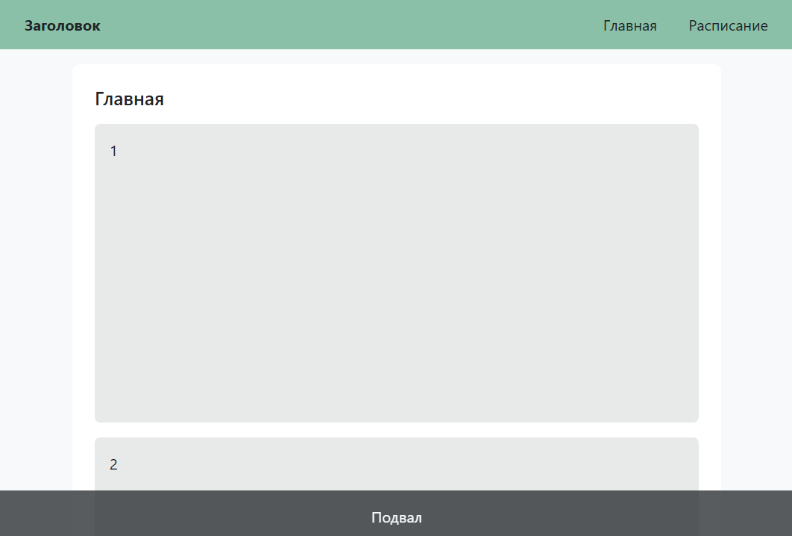

# Несколько сниппетов в макете

Мой store.ts файл:

```javascript
import type { Snippet } from 'svelte';
import { writable, type Writable } from 'svelte/store';

export let Header: Writable<Snippet> = writable();
export let Footer: Writable<Snippet> = writable();
```

Мой +layout.svelte:

```svelte
<script lang="ts">
	import { Footer, Header } from '$lib/scripts/store';
	let { children } = $props();
</script>

{@render $Header?.()}
{@render children?.()}
{@render $Footer?.()}
```

Мой +page.svelte:

```svelte
<script lang="ts">
	import { Header, Footer } from '$lib/scripts/store';
	$Header = header;
	$Footer = footer;

	let array: (string | number)[] = $state([1, 2, 3, 4, 5, 6, 7, 8, 9, 10]);
</script>

{#snippet header()}
	Header
{/snippet}

<div>Content</div>

{#snippet footer()}
	Header
{/snippet}
```


